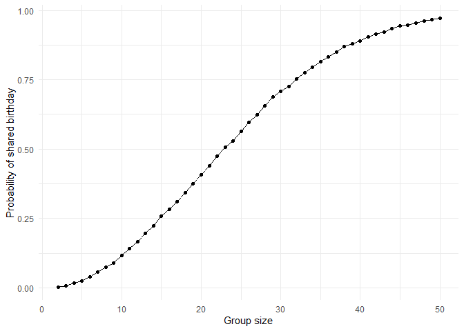
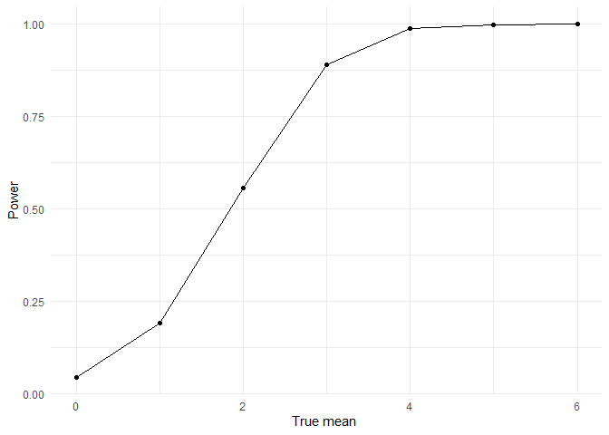

p8105_hw5_tw3108
================
Tao Wu
2025-11-14

## R Markdown

``` r
library(tidyverse)
set.seed(123)
birthdaycheck = function(n) {
  birthdays = sample(1:365, size = n, replace = TRUE)
  any(duplicated(birthdays))
}
sim_data = function(n, time = 10000) {
   result = logical(time)
  for (i in 1:time) {
    result[i] = birthdaycheck(n)
  }
  tibble(
    groupsize = n,
    prob = mean(result)
  )
}
final = tibble()
for (n in 2:50) {
  sim = sim_data(n)
  final = bind_rows(final, sim)
}
final
```

    ## # A tibble: 49 × 2
    ##    groupsize   prob
    ##        <int>  <dbl>
    ##  1         2 0.0033
    ##  2         3 0.0079
    ##  3         4 0.0158
    ##  4         5 0.0248
    ##  5         6 0.0387
    ##  6         7 0.057 
    ##  7         8 0.0749
    ##  8         9 0.0885
    ##  9        10 0.116 
    ## 10        11 0.140 
    ## # ℹ 39 more rows

``` r
final %>% 
  ggplot(aes(x = groupsize, y = prob)) +geom_point() + geom_line() +
  labs(
    x = "Group size",
    y = "Probability of shared birthday",
  ) + theme_minimal()
```

<!-- -->

1 I think the result and plot are very reasonable, as the number of
people in a group increases, the probability of shared birthday rises.
It reaches 0.5 at sample size 23, which is consist with the actual
theory.

``` r
library(tidyverse)
library(broom)  
set.seed(123)
n = 30
sigma = 5
time = 5000
mu = 0:6 
sim_t = function(mu, n = 30, sigma = 5) {
  x = rnorm(n, mean = mu, sd = sigma)
  t = t.test(x, mu = 0)
  tidy(t) |> 
    select(estimate, p.value)
}
sim_t(mu = 0)
```

    ## # A tibble: 1 × 2
    ##   estimate p.value
    ##      <dbl>   <dbl>
    ## 1   -0.236   0.794

``` r
sim_results_df =
  expand_grid(
    truemu = mu,
    iter = 1:time
  ) |>
  mutate(
    estimate_df = map(truemu, sim_t)
  ) |>
  unnest(estimate_df)
power =
  sim_results_df |>
  group_by(truemu) |>
  summarize(power = mean(p.value < 0.05))
power
```

    ## # A tibble: 7 × 2
    ##   truemu  power
    ##    <int>  <dbl>
    ## 1      0 0.0446
    ## 2      1 0.191 
    ## 3      2 0.556 
    ## 4      3 0.890 
    ## 5      4 0.987 
    ## 6      5 0.999 
    ## 7      6 1

``` r
power |>
  ggplot(aes(x = truemu, y = power)) + geom_point() + geom_line() +
  labs(
    x = "True mean ",
    y = "Power",
  ) + theme_minimal()
```

<!-- -->

``` r
est =
  sim_results_df |>
  group_by(truemu) |>
  summarize(
    mean = mean(estimate),                  
    meanreject = mean(estimate[p.value < 0.05]) 
  )
est
```

    ## # A tibble: 7 × 3
    ##   truemu    mean meanreject
    ##    <int>   <dbl>      <dbl>
    ## 1      0 0.00892      0.147
    ## 2      1 1.01         2.23 
    ## 3      2 1.99         2.60 
    ## 4      3 3.01         3.20 
    ## 5      4 3.98         4.01 
    ## 6      5 4.98         4.99 
    ## 7      6 5.99         5.99

``` r
est |>
  ggplot(aes(x = truemu)) +
  geom_line(aes(y = mean), color = "red") +
  geom_point(aes(y = mean), color = "red") +
  geom_line(aes(y = meanreject),color = "blue") +
  geom_point(aes(y = meanreject), color = "blue") +
  labs(
    x = "True mean",
    y = "Average estimate ",
  ) + theme_minimal()
```

<!-- -->

2 Our results show that when mu equals 0-3, the average rejection rate
for H0 is greater than the actual average mu. This is definitely
different because when mu is very small, the difficulty of rejection is
higher because the fluctuation is not very obvious, so it will
definitely be different from real mu. However, as mu increases, we
should expect them to be equal since almost all the samples will be
significant.

``` r
library(tidyverse)
library(broom)
library(purrr)
homicide_df = 
  read_csv("data/homicide-data.csv")
city_df =
  homicide_df |>
  mutate(
    city_state = str_c(city, state, sep = ",")
  ) |>
  group_by(city_state) |>
  summarize( total = n(),
  unsolved = sum(disposition %in% c("Closed without arrest", "Open/No arrest"))
  )
city_df
```

    ## # A tibble: 51 × 3
    ##    city_state     total unsolved
    ##    <chr>          <int>    <int>
    ##  1 Albuquerque,NM   378      146
    ##  2 Atlanta,GA       973      373
    ##  3 Baltimore,MD    2827     1825
    ##  4 Baton Rouge,LA   424      196
    ##  5 Birmingham,AL    800      347
    ##  6 Boston,MA        614      310
    ##  7 Buffalo,NY       521      319
    ##  8 Charlotte,NC     687      206
    ##  9 Chicago,IL      5535     4073
    ## 10 Cincinnati,OH    694      309
    ## # ℹ 41 more rows

``` r
baltimore = city_df |>
  filter(city_state == "Baltimore,MD")
baltimore
```

    ## # A tibble: 1 × 3
    ##   city_state   total unsolved
    ##   <chr>        <int>    <int>
    ## 1 Baltimore,MD  2827     1825

``` r
prop = prop.test(baltimore$unsolved, baltimore$total)
prop_tidy = tidy(prop)
prop_tidy |>
  select(estimate, conf.low, conf.high)
```

    ## # A tibble: 1 × 3
    ##   estimate conf.low conf.high
    ##      <dbl>    <dbl>     <dbl>
    ## 1    0.646    0.628     0.663

``` r
city_test = city_df |>
   mutate(
    test_result = map2( unsolved, total,\(u, t) prop.test(u, t)),
    tidy = map(test_result, broom::tidy)
  ) |>
  unnest(tidy)
city_test |>
  select(city_state, estimate, conf.low, conf.high)
```

    ## # A tibble: 51 × 4
    ##    city_state     estimate conf.low conf.high
    ##    <chr>             <dbl>    <dbl>     <dbl>
    ##  1 Albuquerque,NM    0.386    0.337     0.438
    ##  2 Atlanta,GA        0.383    0.353     0.415
    ##  3 Baltimore,MD      0.646    0.628     0.663
    ##  4 Baton Rouge,LA    0.462    0.414     0.511
    ##  5 Birmingham,AL     0.434    0.399     0.469
    ##  6 Boston,MA         0.505    0.465     0.545
    ##  7 Buffalo,NY        0.612    0.569     0.654
    ##  8 Charlotte,NC      0.300    0.266     0.336
    ##  9 Chicago,IL        0.736    0.724     0.747
    ## 10 Cincinnati,OH     0.445    0.408     0.483
    ## # ℹ 41 more rows

``` r
city_sorted = city_test |>
  arrange(estimate) |>      
  mutate(city_state = factor(city_state, levels = city_state))
city_sorted |>
  ggplot(aes(x = estimate, y = city_state)) + geom_point() +
  geom_errorbar(aes(xmin = conf.low, xmax = conf.high), width = 0) +
  labs(
    x = "Proportion of unsolved homicides",
    y = "City"
  ) + theme_minimal()
```

<!-- -->
